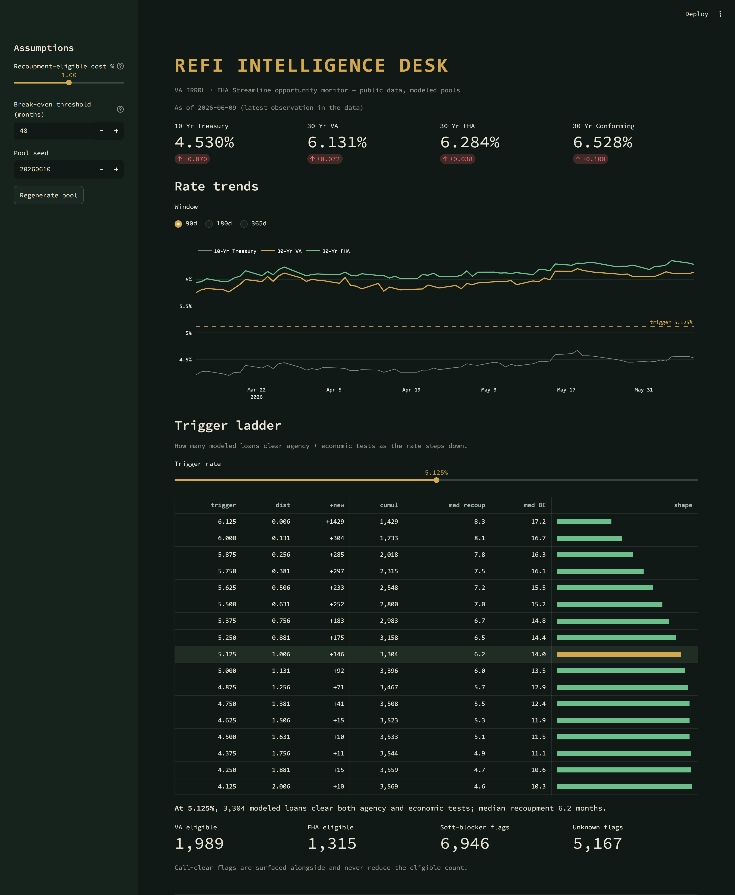

# refi-intel-desk

**Mortgage refi opportunity dashboard — public rate data, trigger-ladder modeling, AI-generated morning briefs.** Python / Streamlit / SQLite / Anthropic API.

## The problem

Mortgage professionals watch interest rates every day, but watching a rate move isn't the same as knowing what to *do* about it. The question that actually matters is: at what rate does a real book of loans become worth refinancing? Answering that means running each loan against regulatory tests — does the borrower get a real benefit, and do they recoup their closing costs in a reasonable time? `refi-intel-desk` turns daily public rate movement into an actionable signal: the rate trigger at which a modeled pool of VA and FHA loans clears those tests.

## What it does

- Tracks the **10-Year Treasury** yield and **30-year VA/FHA average rates** from public sources (FRED, Freddie Mac PMMS).
- Models a **synthetic loan pool** organized by note-rate cohort.
- Computes a **rate trigger ladder** — for each candidate rate, how many modeled loans clear both the net-tangible-benefit and recoupment tests.
- Generates a **daily AI morning brief** in plain English, with an eval harness that proves every number in the brief matches the underlying data.

## Screenshot



*(screenshot lands in Step 4)*

## Architecture

Plain-English flow:

```
Public APIs (FRED, Freddie Mac PMMS)
        │
        ▼
   Ingest pipeline  ──▶  SQLite  ──▶  Analysis core
                                          │
                                          ▼
                                  Streamlit dashboard
                                          │
                                          ▼
                       Anthropic API brief  +  eval harness
```

See [docs/architecture.md](docs/architecture.md) for a layer-by-layer description.

## Glossary

- **Note rate** — the interest rate written on the borrower's existing loan; what a refinance would replace.
- **VA IRRRL** — the VA's "Interest Rate Reduction Refinance Loan," a streamlined refinance for veterans that lowers the rate with minimal paperwork.
- **FHA Streamline** — the FHA's equivalent streamlined refinance for existing FHA borrowers, with reduced documentation.
- **Net tangible benefit (NTB)** — a required test that the refinance actually helps the borrower (for example, a meaningful drop in rate or payment), not just generates a transaction.
- **Recoupment** — how long it takes the monthly savings to pay back the loan's closing costs; a refinance is only sensible if that payback period is short enough.

## Data sources & disclaimer

All data comes from **public sources only** — FRED (Federal Reserve) and Freddie Mac's Primary Mortgage Market Survey. **Every loan pool in this project is synthetic and modeled; no real borrower, lead, or employer data is used.** This software is an educational and portfolio project. It is **not financial advice**, and **no NMLS-regulated activity occurs** anywhere in it.

## Roadmap

- [x] **Step 1** — Repo skeleton, README, license, structure
- [ ] **Step 2** — Data pipeline (FRED + PMMS ingest into SQLite)
- [ ] **Step 3** — Analysis core (NTB, recoupment, trigger ladder)
- [ ] **Step 4** — Streamlit dashboard + screenshot
- [ ] **Step 5** — AI morning brief + eval harness
- [ ] **Step 6** — Live deployment + link

## About

Built by a mortgage professional with 34 years in lending and 12-state licensure, as an exploration of AI engineering applied to deep domain knowledge. The aim is to show what happens when subject-matter expertise and modern AI tooling meet on a real-world problem.
